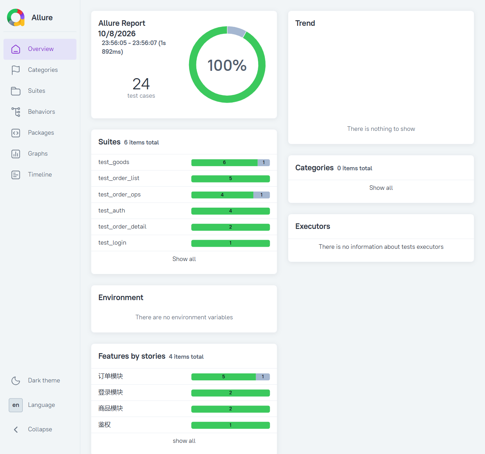

# litemall 商城（用户端）接口自动化测试


基于开源电商项目 [litemall](https://github.com/linlinjava/litemall) 用户端的接口测试项目：从接口盘点、用例设计到自动化落地与缺陷定位的完整实践。

## 技术栈

`Python` `pytest` `requests` `Allure` `Postman` `MySQL` `Docker` `Git` `GitHub Actions`

## 项目结构

```
├── config.py                # 配置层：测试环境地址、测试账号
├── api_client.py            # 接口层：LitemallClient 封装登录、商品、订单接口
├── conftest.py              # 夹具层：登录态 token、测试数据自动获取
├── pytest.ini               # pytest 配置
├── test_login.py            # 登录模块用例
├── test_auth.py             # 登录失败与鉴权拦截用例
├── test_goods.py            # 商品模块用例
├── test_order_list.py       # 订单列表用例（参数化）
├── test_order_detail.py     # 订单详情用例
├── test_order_ops.py        # 订单操作用例（状态校验拦截）
├── mock_server.py           # CI 用 mock 服务：云端无真实后端时替代真实接口
└── .github/workflows/       # GitHub Actions 持续集成配置
```

分层设计：用例层只描述"发什么请求、断言什么"，接口细节收敛在 api_client.py，环境配置收敛在 config.py，更换测试环境只需修改一个文件。

## 用例覆盖情况

| 模块 | 用例数 | 覆盖内容 |
| --- | --- | --- |
| 登录 | 3 | 正确登录返回有效 token；密码错误、用户名不存在 |
| 鉴权 | 2 | 无 token / 无效 token 访问订单接口被拦截 |
| 商品 | 7 | 列表分页与非法排序字段、关键字无匹配、详情正常与异常 |
| 订单列表 | 5 | 分页边界值（page / limit 越界回落）、非法参数 |
| 订单详情 | 2 | 正常查询、订单不存在 |
| 订单操作 | 5 | 订单状态机校验拦截、越权与不存在订单、已知缺陷监控 |
| **合计** | **24** | 通过 22 条，预期失败 2 条（对应 2 个已知缺陷） |

## 运行方式

```bash
pip install -r requirements.txt
python -m pytest --alluredir=allure-results --clean-alluredir
allure serve allure-results
```

## 持续集成

推送到 main 分支后，GitHub Actions 自动执行全部用例并归档 Allure 结果。由于云端环境没有真实后端与数据库，CI 中由 `mock_server.py` 提供与真实接口行为一致的模拟服务——包括已知缺陷的响应，用于持续监控 xfail 用例。

## 测试报告
完整测试报告：[测试报告](docs/测试报告.md)


## 缺陷发现

测试过程中累计发现 9 个缺陷：

| 编号 | 缺陷描述 | 模块 | 严重程度 |
| --- | --- | --- | --- |
| BUG-001 | 忘记密码页"获取验证码"按钮点击后仅启动倒计时，不调用发码接口 | 忘记密码 | 严重 |
| BUG-002 | 注册页输入 10 位或 12 位手机号点击"下一步"无反应，无任何提示 | 注册 | 严重 |
| BUG-003 | 忘记密码页"下一步"不校验手机号与验证码，直接跳转重置页 | 忘记密码 | 严重 |
| BUG-004 | 进入密码重置页即提示"两次密码输入不一致" | 忘记密码 | 严重 |
| BUG-005 | 忘记密码页"重置密码"按钮点击无任何反应 | 忘记密码 | 严重 |
| BUG-006 | 退款接口被状态校验拦截时提示"订单不能取消"，与退款操作不符 | 订单 / 接口 | 轻微 |
| BUG-007 | 商品 ID 不存在时返回 502 系统内部错误，同场景下订单接口返回业务错误码 | 商品 / 接口 | 中等 |
| BUG-008 | 参数校验失败时提示暴露内部参数名（`arg1must not be null`、`arg8排序字段不支持`） | 接口规范 | 轻微 |
| BUG-009 | 登录接口可通过提示区分"账号不存在"与"账号密码不对"，存在用户名枚举风险 | 登录 / 安全 | 轻微 |

其中 BUG-006、BUG-007 已用 `@pytest.mark.xfail` 固化为自动化用例持续监控：缺陷修复后对应用例会转为 XPASS，提醒更新断言。

## 被测系统

litemall（Spring Boot + MyBatis + MySQL + Vue），通过 Docker 部署测试环境。
